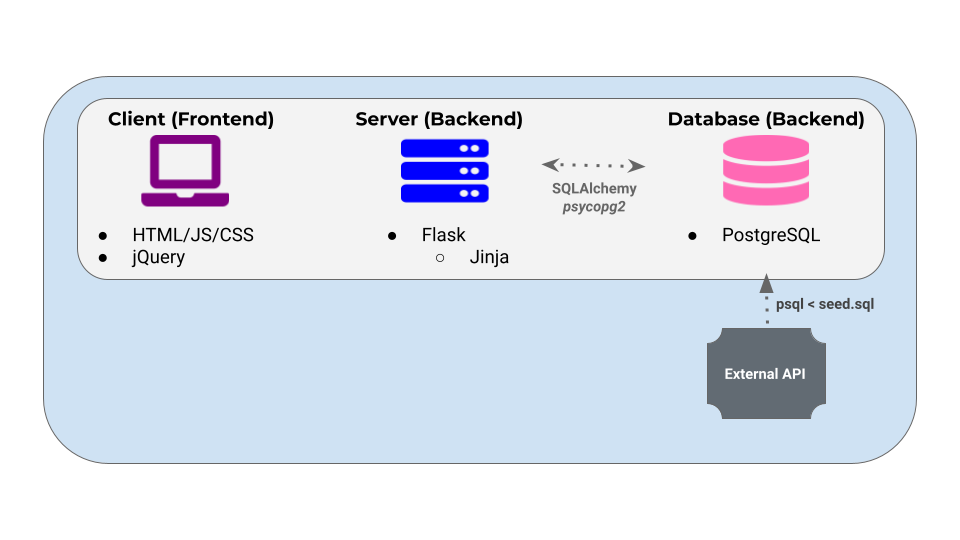

## Project Name
### Credit Card Finder Web App  

## Case Description
* **Purpose:**  
To create a website that helps users find the best rewards credit card for their needs.

* **Overview:**  
The app provides users with a comprehensive list of rewards credit cards available on the web, while helping them find the credit cards that maximize the rewards dollar value of their everyday spending habits.  
Contrary to similar webs available, this is an independent app that has no comercial strings with credit card companies.

* **Actors:**  
	- Anyone shopping for a rewards credit card:
Is my current credit card good enough? Can I find a better one?
			I got this credit card offer in the mail, is it good enough?
	- Product managers from credit card companies may use the app as a central repository of card offers and value propositions available in the market.

## User Flow
Find the best rewards credit card for you in 3 easy steps:

1. Filter 350+ credit cards.
2. Fill out form with your spending habits.
3. Apply for a card.

Compare credit cards from all of the major issuers and quickly find the best rewards credit card for your needs. Start by applying filters from the left side of the page to narrow down your search. This will allow you to focus on comparing credit cards that actually offer the features you want. Next, fill out the spend form with your spending habits and we'll calculate the first year rewards that you would earn on each card. To apply for a credit card, simply click the "Apply Now" button, and we will connect you to the issuer’s secure online credit card application.

## Tech

## Functionality Design

## Database Schema
 

## URL
[https://cc-finder.herokuapp.com/](https://cc-finder.herokuapp.com/)

## Contact
email:  juan.guzman.sd@gmail.com
